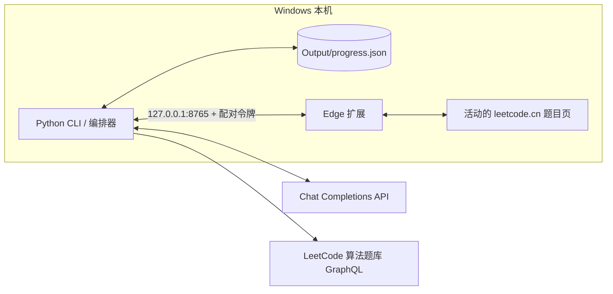
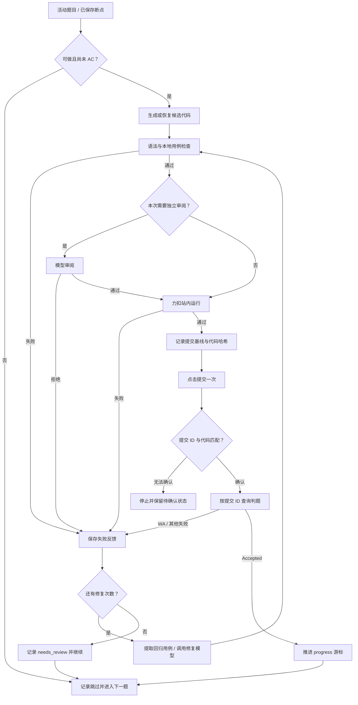

# Agent4PS

Agent4PS 是在 Windows 本机运行的 LeetCode 中国站 Python3 刷题代理。Python 进程负责题目编排、模型调用、校验与进度记录；Edge 扩展操作当前活动的题目标签页。代理从活动题目或可恢复的保存进度开始，按算法题号继续处理。

项目当前面向**个人本机运行**：需要已登录 `leetcode.cn` 的 Microsoft Edge、可用的 Chat Completions API，以及人工处理登录验证、无法确认的提交和站点接口变化。模型输出与站内判题结果均可能失败，程序以正式提交 ID 和力扣返回的 Accepted 作为自动完成依据。

## 目录

- [工作方式](#工作方式)
- [快速开始](#快速开始)
- [执行与恢复](#执行与恢复)
- [配置参考](#配置参考)
- [故障排查](#故障排查)
- [项目结构与测试](#项目结构与测试)
- [安全与限制](#安全与限制)
- [文档参考](#文档参考)

## 工作方式

### 组件与数据流



扩展读取题目和站内判题信息，执行代码写入、运行、提交及导航；Python 进程不接收浏览器 Cookie。模型 API 接收题目描述、起始代码、候选解法和必要的失败反馈。桥接服务只监听 `127.0.0.1`，默认端口 `8765`。

### 单题执行流程



首次求解默认在同一次模型请求中完成边界与复杂度自检；修复候选会再接受独立审阅。站内 WA 时，程序将判题输入、实际输出和预期输出传给修复模型。可解析的 JSON 参数会成为本地回归用例；若新代码仍与失败代码逻辑相同，或无法通过保存的回归用例，程序会把拒绝原因发给备用模型，不会把该版本提交到力扣。两次验证失败后可搜索公开题解，搜索结果只作为参考文本。

## 快速开始

### 1. 准备环境

需要 Windows、Python 3.12、Microsoft Edge，以及能够访问 `leetcode.cn` 和所配置模型 API 的网络。VS Code 终端是推荐的运行位置，但不是程序依赖。Node.js 只用于运行扩展的开发测试。

在项目根目录执行：

```powershell
py -3.12 -m venv .venv
.\.venv\Scripts\python.exe -m pip install -r requirements.txt
```

### 2. 配置模型密钥

`config.yaml` 保存 API 地址、模型 ID 和密钥**环境变量名**，不保存密钥值。当前变量名为 `INTERN_AI_API_KEY`。可在当前 PowerShell 会话中隐藏输入：

```powershell
$secret = Read-Host 'Intern AI API Key' -AsSecureString
$env:INTERN_AI_API_KEY = [System.Net.NetworkCredential]::new('', $secret).Password
Remove-Variable secret
```

若 VS Code 终端尚未继承 Windows 用户环境变量，程序也会读取该用户环境变量。不要把密钥写入仓库、命令参数或进度文件；已经泄露的密钥应在提供方控制台轮换。

### 3. 安装并配对扩展

1. 在 Edge 打开 `edge://extensions`，启用开发者模式，选择“加载解压缩的扩展”，指向项目的 `extension/` 目录。
2. 在同一个 Edge 配置中登录 [leetcode.cn](https://leetcode.cn/)，打开一个算法题页面并保持该标签为活动标签。
3. 在终端运行以下命令；`doctor` 会检查 Edge、扩展文件、题库和模型 API，因此需要网络与已配置的密钥。

```powershell
.\.venv\Scripts\python.exe -m leetcode_agent doctor
.\.venv\Scripts\python.exe -m leetcode_agent run
```

4. 首次连接时，点击 Edge 工具栏的 Agent4PS 图标，输入**这次运行**显示的 6 位配对码。配对码 10 分钟内有效；成功后扩展会刷新活动题目页。后续通常沿用 `.local/bridge-token` 与扩展本地存储中的配对令牌。

扩展弹窗的“本地端口”必须与 `config.yaml` 的 `browser.port` 一致。修改 Python 代码或配置后需重启 `run`；修改扩展文件后还需在 `edge://extensions` 重新加载扩展并刷新题目页。

### 4. 查看与停止

```powershell
.\.venv\Scripts\python.exe -m leetcode_agent status
```

交互式终端显示当前题目的阶段、耗时和详细日志。按 `Ctrl+C` 停止；手动提交或切换题目前，先停止运行器，避免与自动流程竞争。`login` 命令只打印登录提示，不会代替浏览器登录。

| 命令 | 用途 |
| --- | --- |
| `doctor` | 检查本机 Edge、扩展文件、题库和模型 API |
| `run` | 启动桥接服务并从保存进度继续 |
| `run --start-current` | 明确以活动题号为起点，仍受已有进度保护 |
| `status` | 查看下一题号及各题状态 |
| `resolve --resolution accepted\|retry` | 人工核对后处理无法自动确认的提交 |
| `login` | 打印浏览器登录提示 |

所有命令都可通过 `--config <路径>` 指定配置文件；默认读取当前目录的 `config.yaml`。

## 执行与恢复

### 进度与产物

`Output/progress.json` 保存游标和当前未完成题目的恢复状态；已完成记录按题号分片保存到 `Output/progress-history/`。下次启动会自动迁移旧版进度，`status` 仍可显示完整历史。当前 `config.yaml` 设置 `output.save_artifacts: false`：候选代码、检查结果与参考资料作为当前题快照保存在进度文件中；不会新建或改写每题的 `solution.py`、`README.md`、`attempts/` 或浏览器草稿文件。既有题目目录保持原样。

将 `output.save_artifacts` 改为 `true` 后，程序会恢复每题目录产物，包括候选版本、验证记录和题解摘要。当前题尚未完成时，`progress.json` 可能包含完整候选代码；备份和共享前应检查内容。

本地校验会按 `ListNode` 类型标注或题目元数据，将链表样例的数组构造成节点，并将返回链表转回数组比较。重启时若保存的是本地校验失败，程序会先重验原候选；重验通过就继续站内运行。

题面 HTML 中的图片会保留在文字里的原位置。设置 `api.vision_model` 后，程序会把图片 URL 交给视觉模型生成图意，再把描述提供给求解、审阅与修复模型。视觉请求计入 `workflow.max_model_calls`；图片无法读取时保留当前题号并停止。

| 状态 | 含义 | 重启后的处理 |
| --- | --- | --- |
| `candidate_ready` / `run_verified` | 已保存候选，尚未确认正式提交 | 重新校验候选，继续当前题 |
| `needs_repair` | 已保存失败反馈 | 本地失败先重验；其余失败带用例请求修复 |
| `submit_intent` / `submission_unconfirmed` | 已准备或发起提交，结果尚未确认 | 只读查询提交记录及判题，不再次点击提交 |
| `accepted` | 本程序按提交 ID 确认 Accepted | 从下一题继续 |
| `already_accepted` / `skipped` | 站内已有 AC，或题目缺失、付费、不可运行 | 从下一题继续 |
| `needs_review` | 用完修复次数 | 记录待人工审查，并继续下一题 |
| `user_reported_accepted` | 用户人工确认的提交结果 | 从下一题继续；不等同于程序确认的 AC |

启动时若存在可恢复的候选或待确认提交，会优先处理保存的题号。首次运行从活动题目开始；已有进度且无待恢复工作时，若活动题号大于保存游标，也会以活动题号为起点。`run --start-current` 用于明确选择活动题号，但不能越过待确认提交、丢弃已保存候选，或回到已完成题号。

### 提交确认与人工处理

提交前，扩展读取该题最新提交 ID 作为基线，Python 保存候选代码的 SHA-256。点击提交后，扩展捕获正式提交 ID，并核对该 ID 对应的站内代码。仅当 ID、代码和判题结果可关联时，程序才把 Accepted 记为自动完成。页面刷新或回执丢失时，只读查询基线之后的新提交；无法唯一确认时保留待确认状态并停止。

旧版本的记录若缺少可恢复的 ID 或基线，需要先在力扣提交记录中人工核对**题号、代码和结果**，再执行其一：

```powershell
# 确认该次提交的代码已经 Accepted
.\.venv\Scripts\python.exe -m leetcode_agent resolve --resolution accepted

# 确认没有成功提交，允许重新尝试当前题
.\.venv\Scripts\python.exe -m leetcode_agent resolve --resolution retry
```

不要仅凭编辑器中显示的代码或一次“运行通过”就使用 `accepted`。无法确认时保留原状态，避免重复提交。

### 等待与导航

写入代码和触发站内操作要求绑定的题目标签处于活动状态。运行前切到其他标签，程序会等待原题标签重新激活并核对题号。确认 AC 后按题库 URL 导航到下一题；目标页 30 秒未出现时会检查扩展状态，必要时等待标签重新激活或重试导航，再等待目标页。仍无法确认则停止，游标保留在下一题。

默认使用页面按钮提交和 URL 导航。`browser.submit_trigger`、`browser.navigation_trigger` 可分别改为 `shortcut`，但力扣是否接受合成快捷键取决于页面实现。模型响应时间、站点加载和判题排队都影响总耗时，程序不保证固定的每题用时。

## 配置参考

以下是当前 `config.yaml` 中最影响运行行为的选项；以文件内容为准。

| 配置项 | 当前值 | 作用 |
| --- | --- | --- |
| `api.endpoint` | `https://discovery-api.intern-ai.org.cn/v1/chat/completions` | Chat Completions 接口 |
| `api.model` / `api.fallback_model` | `deepseek-v4-flash-0731` / `deepseek-v4-pro-0813` | 主模型；无答案正文或修复候选被拒绝时使用备用模型 |
| `api.vision_model` | `deepseek-v4-flash-vision` | 读取题面图片并生成图意；服务需能访问公开图片 URL |
| `api.first_answer_timeout_seconds` / `api.timeout_seconds` | `15` / `60` | 首次正文等待时间；单次模型调用流程的总时限 |
| `api.stream` / `api.thinking` | `true` / `disabled` | 流式接收；请求非思考模式，网关仍可能输出推理流 |
| `browser.host` / `browser.port` | `127.0.0.1` / `8765` | 本机桥接地址；端口须与扩展弹窗一致 |
| `browser.poll_interval_seconds` | `0.5` | 扩展领取命令的轮询间隔 |
| `browser.submit_trigger` / `browser.navigation_trigger` | `button` / `url` | 提交与导航方式 |
| `workflow.max_repairs` / `workflow.max_model_calls` | `3` / `10` | 单题修复次数与模型请求预算 |
| `workflow.review_mode` / `workflow.auto_submit` | `on_repair` / `true` | 独立审阅时机与自动提交开关 |
| `search.fallback_after_failures` / `search.max_pages` | `2` / `3` | 公开题解搜索门槛与读取页数 |
| `output.save_artifacts` | `false` | 暂停每题题解文件；进度与历史仍保存 |

模型流只有在收到完整结束信号后才会被使用；中途断流、HTTP 429/5xx 和连接故障按预算重试。收到回答正文后不会因为首字节计时器切换模型。API 故障、登录失效、验证码或无法确认的站内结果会停止当前运行，并保留可恢复进度。

## 故障排查

| 现象 | 检查与处理 |
| --- | --- |
| `invalid pairing code` | 确认使用**当前** `run` 进程的 6 位码；核对扩展端口与 `browser.port`。旧进程的码、过期码或超过尝试次数的码无效。 |
| 一直等待活动题目标签 | 在主 Edge 窗口激活 `leetcode.cn/problems/.../` 页面并刷新；检查扩展弹窗连接状态。扩展更新后重新加载扩展和题目页。 |
| 协议版本不匹配 | 在 `edge://extensions` 重新加载 Agent4PS，再刷新题目标签；Python 运行器也需重启。 |
| `LeetCode GraphQL HTTP 400` | 刷新题目页并核对登录状态；若仍出现，检查站点页面/API 变化及扩展日志。进度不会因此跳题。 |
| 模型长时间无正文或超时 | 检查 endpoint、模型 ID、密钥和服务状态；可调整 API 超时。超时后当前题号仍保留。 |
| WA 后模型重复原逻辑 | 失败输入、实际输出和预期输出会随修复请求发送；相同逻辑或未通过回归用例的代码会被拒绝，并尝试备用模型。仍失败则停止，保留 `needs_repair`。 |
| `submission_unconfirmed` | 先查看站内提交记录。重启会尝试只读恢复；仍不明确时，人工核对后使用 `resolve`，不要直接再次运行提交。 |
| AC 后下一题加载超时 | 保持绑定标签活动并确认目标题页可打开；游标已在下一题，重启后会从该题继续。 |

## 项目结构与测试

```text
Agent4PS/
├── config.yaml                 # 本机配置；不含密钥值
├── extension/                  # Edge Manifest V3 扩展与页面钩子
├── leetcode_agent/
│   ├── __main__.py             # CLI、启动与提交恢复
│   ├── bridge.py               # 127.0.0.1 桥接与配对
│   ├── extension_browser.py    # 题目页、运行、提交与导航
│   ├── orchestrator.py         # 单题流程及失败修复
│   ├── model.py                # 模型 API 与回答校验
│   └── progress.py             # 游标、快照与可选每题产物
├── Output/progress.json        # 运行后生成；当前持续更新的进度产物
├── Output/progress-history/    # 已完成题目的分片记录
└── tests/                      # Python 与扩展测试
```

开发验证需要额外安装 `pytest`；扩展测试需要 Node.js。测试不会启动自动刷题运行器：

```powershell
.\.venv\Scripts\python.exe -m pip install pytest
.\.venv\Scripts\python.exe -m pytest -q
node --test tests/extension-hook.test.mjs tests/extension-background.test.mjs
```

## 安全与限制

- 配对令牌保存在 `.local/bridge-token` 和扩展本地存储；不要把该文件、API 密钥或完整 `Output/progress.json` 上传到公开仓库。
- 浏览器 Cookie 留在 Edge；模型 API 会收到题目内容、代码及必要的失败反馈。公开题解搜索仅在配置门槛达到后进行。
- 本地校验在限时、精简环境的子进程中运行模型生成的 Python 代码，**不是操作系统级沙箱**。请在可信本机环境使用。
- 扩展依赖力扣页面结构与站内接口；站点改版可能需要更新扩展。无法确认代码、提交 ID 或判题归属时，程序会停止以保留审查机会。
- 当前只支持 `leetcode.cn` 的算法题和 Python3，不提供多用户服务或远程浏览器部署。

## 文档参考

本文档的安装、能力边界、配置表与 FAQ 编排参考了 [leetcode-mcp-server 中文 README](https://github.com/jinzcdev/leetcode-mcp-server/blob/main/README_zh-CN.md) 和 [browser-use README](https://github.com/browser-use/browser-use/blob/main/README.md)。这些链接仅作为文档组织参考；Agent4PS 的运行依赖以本仓库 `requirements.txt` 和 `config.yaml` 为准。
