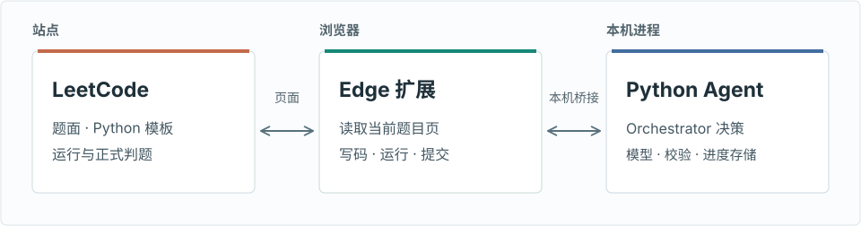
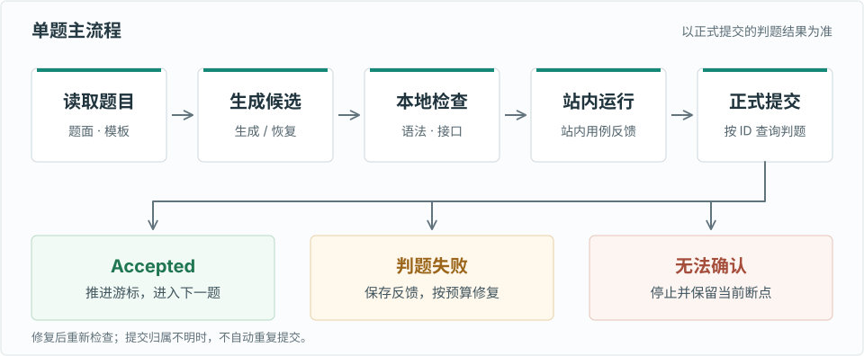

# Agent4PS

Agent4PS 是在 Windows 本机运行的 LeetCode 中国站 Python3 刷题 Agent。它从当前题目或保存的断点出发，读取题面与代码模板，生成候选解法，调用站内运行和判题，再根据反馈修复或推进到下一题。

模型是解题组件，Agent 的控制逻辑在 Python 编排器中：它决定何时求解、审阅、运行、提交、修复、检索参考资料或停止，并把候选代码和反馈写入持久状态。只有正式提交 ID 对应的代码经力扣判为 Accepted，才算自动完成。项目面向**个人本机运行**，登录验证、无法确认的提交和站点接口变化仍需人工处理。

## 目录

- [Agent 架构](#agent-架构)
- [快速开始](#快速开始)
- [执行与恢复](#执行与恢复)
- [配置参考](#配置参考)
- [故障排查](#故障排查)
- [项目结构与测试](#项目结构与测试)
- [安全与限制](#安全与限制)
- [文档参考](#文档参考)

## Agent 架构

### 组成与职责

| Agent 环节 | 实现 | 职责 |
| --- | --- | --- |
| 目标与决策 | `Orchestrator` | 按题号和保存状态选择下一步；控制审阅、修复、搜索、提交和停止的条件与预算 |
| 感知 | `ProblemCatalog`、`ExtensionBrowser`、Edge 扩展 | 获取题目、Python3 模板、站内运行结果与正式判题反馈；有图时可调用视觉模型描述图片 |
| 推理 | `ModelClient` | 根据题面生成代码；审阅修复候选，并按配置审阅首次候选；结合失败反馈修复代码，必要时切换备用模型 |
| 工具与环境 | 本地校验、`BrowserBridge`、Edge 扩展 | 检查语法和提交接口；在活动题目页写入、运行、提交代码并导航 |
| 记忆 | `ProgressStore`、`ArtifactStore` | 保存题号游标、候选、检查结果、参考资料和提交确认状态，供重启恢复 |

编排器以 `Problem`、`Candidate` 和 `CheckResult` 为阶段数据，按修复次数、模型请求预算与提交确认条件推进状态。浏览器扩展接触 `leetcode.cn` 页面；Python 进程通过只监听 `127.0.0.1` 的配对桥接服务下达动作，不接收浏览器 Cookie。

<picture>
  <source media="(max-width: 600px)" srcset="docs/diagrams/architecture-mobile.svg">
  
</picture>

模型 API 会收到题目描述、官方模板、候选代码和必要的失败反馈；公开题解仅在达到配置的失败门槛后作为参考输入。桥接服务默认使用端口 `8765`。

### 单题决策循环

<picture>
  <source media="(max-width: 600px)" srcset="docs/diagrams/problem-flow-mobile.svg">
  
</picture>

**感知。** 题面来自当前题的 GraphQL `translatedContent`（缺失时使用 `content`），仅解析题目 HTML；不会读取题解、评论、相关题目或页面页脚。模型同时收到 Python3 `codeSnippets` 中的官方提交模板。长题面优先保留开头的题意和末尾的约束。题面图片保留在原位置，配置视觉模型后会生成图意描述。

**生成与验证。** 首次求解返回完整 Python 提交代码；修复候选接受独立审阅，首次候选是否审阅由配置决定。语法错误、与官方模板不符的类名或方法签名会阻止站内运行。模型自拟用例不作为判题依据；可解析的站内用例可供本地诊断，但本地输出分歧不会替代站内判题。

**反馈与决策。** 站内 WA 的失败输入、实际输出和预期输出会进入修复请求；运行时或编译错误则传递站内错误文本。修复结果若与失败代码的 Python 逻辑相同，会尝试备用模型。反馈无法确认、提交归属不明或预算耗尽时，Agent 保存状态并停止或标记待审查，不会把一次“运行通过”当作 Accepted。

## 快速开始

### 1. 准备环境

需要 Windows、Python 3.12、Microsoft Edge，以及能够访问 `leetcode.cn` 和所配置模型 API 的网络。VS Code 终端是推荐的运行位置，但不是程序依赖。Node.js 只用于运行扩展的开发测试。

在项目根目录执行：

```powershell
py -3.12 -m venv .venv
.\.venv\Scripts\python.exe -m pip install -e .
.\.venv\Scripts\Activate.ps1
```

### 2. 配置模型密钥

`config.yaml` 保存 API 地址、模型 ID 和密钥**环境变量名**，不保存密钥值。当前变量名为 `INTERN_AI_API_KEY`。可在当前 PowerShell 会话中隐藏输入：

```powershell
$secret = Read-Host 'Intern AI API Key' -AsSecureString
$env:INTERN_AI_API_KEY = [System.Net.NetworkCredential]::new('', $secret).Password
Remove-Variable secret
```

若 VS Code 终端尚未继承 Windows 用户环境变量，程序也会读取该用户环境变量。不要把密钥写入仓库、命令参数或进度文件；已经泄露的密钥应在提供方控制台轮换。

### 3. 安装并配对扩展

1. 在 Edge 打开 `edge://extensions`，启用开发者模式，选择“加载解压缩的扩展”，指向项目的 `extension/` 目录。
2. 在同一个 Edge 配置中登录 [leetcode.cn](https://leetcode.cn/)，打开一个算法题页面并保持该标签为活动标签。
3. 在终端运行以下命令；`doctor` 会检查 Edge、扩展文件、题库和模型 API，因此需要网络与已配置的密钥。

```powershell
.\.venv\Scripts\python.exe -m leetcode_agent doctor
run
```

4. 首次连接时，点击 Edge 工具栏的 Agent4PS 图标，输入**这次运行**显示的 6 位配对码。配对码 10 分钟内有效；成功后扩展会刷新活动题目页。之后会沿用 `.local/bridge-token`；即使扩展本地存储丢失，同一扩展身份也可自动恢复配对。

`run` 是安装到已激活虚拟环境的命令，等同于 `python -m leetcode_agent run`；`run --start-current` 和 `run --config <路径>` 仍可使用。未激活虚拟环境时，可继续使用完整的 Python 命令。扩展弹窗的“本地端口”必须与 `config.yaml` 的 `browser.port` 一致。修改 Python 代码或配置后需重启 `run`；修改扩展文件后还需在 `edge://extensions` 重新加载扩展并刷新题目页。本次升级为解压版扩展固定了 ID，因此升级后可能需再输入一次配对码；后续更新沿用该身份。

### 4. 查看与停止

```powershell
.\.venv\Scripts\python.exe -m leetcode_agent status
```

交互式终端显示当前题目的阶段、耗时和详细日志。按 `Ctrl+C` 停止。若运行卡住并由你手动提交 AC、点击下一题，Agent 会只读核对原题的站内 AC 状态，确认后从新题继续；无法确认时停止并保留原题断点。`login` 命令只打印登录提示，不会代替浏览器登录。

| 命令 | 用途 |
| --- | --- |
| `doctor` | 检查本机 Edge、扩展文件、题库和模型 API |
| `run` | 启动桥接服务并从保存进度继续 |
| `run --start-current` | 明确以活动题号为起点，仍受已有进度保护 |
| `status` | 查看下一题号及各题状态 |
| `resolve --resolution accepted\|retry` | 人工核对后处理无法自动确认的提交 |
| `login` | 打印浏览器登录提示 |

所有命令都可通过 `--config <路径>` 指定配置文件；默认读取当前目录的 `config.yaml`。

## 执行与恢复

### 进度与产物

`Output/progress.json` 保存游标和当前未完成题目的恢复状态；已完成记录按题号分片保存到 `Output/progress-history/`。下次启动会自动迁移旧版进度，`status` 仍可显示完整历史。当前 `config.yaml` 设置 `output.save_artifacts: false`：候选代码、检查结果与参考资料作为当前题快照保存在进度文件中；不会新建或改写每题的 `solution.py`、`README.md`、`attempts/` 或浏览器草稿文件。既有题目目录保持原样。

将 `output.save_artifacts` 改为 `true` 后，程序会恢复每题目录产物，包括候选版本、验证记录和题解摘要。当前题尚未完成时，`progress.json` 可能包含完整候选代码；备份和共享前应检查内容。

本地校验会按类型标注或题目元数据，将链表数组构造成 `ListNode`、二叉树层序数组构造成 `TreeNode`，并把返回的节点结构转回数组比较。力扣常见的 `Optional`、`List` 等类型标注也会在本地提供。与力扣预置定义完全一致的节点样板类会在运行前移除；其他同名类会被本地校验拦下，避免站内返回类型错误。手动判题、自定义节点容器、交互接口及无法用 JSON 样例可靠表示的类型会跳过本地用例，继续交给力扣站内运行验证。旧版进度中若保存了本地用例失败，重启时会去掉模型自拟用例并重验原候选。

题面 HTML 中的图片会保留在文字里的原位置。设置 `api.vision_model` 后，程序会把图片 URL 交给视觉模型生成图意，再把描述提供给求解、审阅与修复模型。视觉请求计入 `workflow.max_model_calls`；图片无法读取时保留当前题号并停止。

| 状态 | 含义 | 重启后的处理 |
| --- | --- | --- |
| `candidate_ready` / `run_verified` | 已保存候选，尚未确认正式提交 | 重新校验候选，继续当前题 |
| `needs_repair` | 已保存失败反馈 | 旧本地用例失败先重验；站内失败带原始反馈请求修复 |
| `submit_intent` / `submission_unconfirmed` | 已准备或发起提交，结果尚未确认 | 只读查询提交记录及判题，不再次点击提交；确认 WA/TLE 后转入修复。若用户已手动 AC 且绑定标签到了下一题，可核对站内 AC 后继续 |
| `accepted` | 本程序按提交 ID 确认 Accepted | 从下一题继续 |
| `already_accepted` / `skipped` | 站内已有 AC，或题目缺失、付费、不可运行 | 从下一题继续 |
| `needs_review` | 用完修复次数 | 记录待人工审查，并继续下一题 |
| `user_reported_accepted` | 用户人工确认的提交结果 | 从下一题继续；不等同于程序确认的 AC |

启动时若存在可恢复的候选或待确认提交，会优先处理保存的题号。首次运行从活动题目开始；已有进度且无待恢复工作时，若活动题号大于保存游标，也会以活动题号为起点。`run --start-current` 用于明确选择活动题号，但不能越过待确认提交、丢弃已保存候选，或回到已完成题号。

### 提交确认与人工处理

提交前，扩展读取该题最新提交 ID 作为基线，Python 保存候选代码的 SHA-256。点击提交后，扩展捕获正式提交 ID，并核对该 ID 对应的站内代码。若详情接口此时限流，ID 会以“未核验”状态保存；程序先尝试切到下一题页面并等待 60 秒，然后确认旧提交属于原题且代码哈希匹配，再查询判题。旧提交未确认前不会开始解下一题。仅当 ID、代码和判题结果可关联时，程序才把 Accepted 记为自动完成。页面刷新或回执丢失时，只读查询基线之后的新提交；若没有 ID 但站内可确认原题 AC，则记为 `already_accepted` 并继续，不冒称程序提交成功。继续限流时会再退避查询，不会再次点击提交；重启后确认该提交为 WA、TLE 或运行时错误时，会保存反馈并继续修复。

旧版本的记录若缺少可恢复的 ID 或基线，需要先在力扣提交记录中人工核对**题号、代码和结果**，再执行其一：

```powershell
# 确认该次提交的代码已经 Accepted
.\.venv\Scripts\python.exe -m leetcode_agent resolve --resolution accepted

# 确认没有成功提交，允许重新尝试当前题
.\.venv\Scripts\python.exe -m leetcode_agent resolve --resolution retry
```

不要仅凭编辑器中显示的代码或一次“运行通过”就使用 `accepted`。无法确认时保留原状态，避免重复提交。

### 等待与导航

写入代码和触发站内操作要求绑定的题目标签处于活动状态。运行前切到其他标签，程序会等待原题标签重新激活并核对题号。确认 AC 后按题库 URL 导航到下一题；目标页 30 秒未出现时会检查扩展状态，必要时等待标签重新激活或重试导航，再等待目标页。仍无法确认则停止，游标保留在下一题。

单题执行期间手动提交 AC 并在绑定标签点击下一题时，若原题执行被导航打断，Agent 会从新页面只读查询原题状态。只有新页面是紧接着的题目、原题题号与 slug 匹配且站内返回 AC，才记录 `already_accepted` 并继续。恢复 `submit_intent` 或 `submission_unconfirmed` 时也会先做这项核对；旧提交 ID 作为未确认的审计信息保留，不会被记为本程序提交成功。若未确认站内 AC，仍按旧提交 ID 查询，不重复点击提交。

默认使用页面按钮提交和 URL 导航。`browser.submit_trigger`、`browser.navigation_trigger` 可分别改为 `shortcut`，但力扣是否接受合成快捷键取决于页面实现。模型响应时间、站点加载和判题排队都影响总耗时，程序不保证固定的每题用时。

## 配置参考

以下是当前 `config.yaml` 中最影响运行行为的选项；以文件内容为准。

| 配置项 | 当前值 | 作用 |
| --- | --- | --- |
| `api.endpoint` | `https://discovery-api.intern-ai.org.cn/v1/chat/completions` | Chat Completions 接口 |
| `api.model` / `api.fallback_model` | `deepseek-v4-flash-0731` / `deepseek-v4-pro-0813` | 主模型；无答案正文、返回格式不合要求或修复候选被拒绝时使用备用模型 |
| `api.vision_model` | `deepseek-v4-flash-vision` | 读取题面图片并生成图意；服务需能访问公开图片 URL |
| `api.first_answer_timeout_seconds` / `api.primary_completion_timeout_seconds` / `api.timeout_seconds` | `15` / `60` / `180` | 首次正文、主模型完成期限与整次调用总时限；主模型超时后备用模型使用剩余预算 |
| `api.stream` / `api.thinking` | `true` / `disabled` | 流式接收；请求非思考模式，网关仍可能输出推理流 |
| `browser.host` / `browser.port` | `127.0.0.1` / `8765` | 本机桥接地址；端口须与扩展弹窗一致 |
| `browser.poll_interval_seconds` | `0.5` | 扩展领取命令的轮询间隔 |
| `browser.submit_trigger` / `browser.navigation_trigger` | `button` / `url` | 提交与导航方式 |
| `workflow.max_repairs` / `workflow.max_model_calls` | `3` / `10` | 单题修复次数与模型请求预算 |
| `workflow.review_mode` / `workflow.auto_submit` | `on_repair` / `true` | 独立审阅时机与自动提交开关 |
| `search.fallback_after_failures` / `search.max_pages` | `2` / `3` | 公开题解搜索门槛与读取页数 |
| `output.save_artifacts` | `false` | 暂停每题题解文件；进度与历史仍保存 |

模型流只有在收到完整结束信号后才会被使用；中途断流、HTTP 429/5xx 和连接故障按预算重试。收到回答正文后不会因 15 秒首答计时器切换模型；若主模型在 60 秒内仍未完成，则丢弃半截输出并把剩余时间交给备用模型。总时限仍到期或 API 故障、登录失效、验证码、站内结果不明确时会停止当前运行，并保留可恢复进度。

## 故障排查

| 现象 | 检查与处理 |
| --- | --- |
| `invalid pairing code` | 确认使用**当前** `run` 进程的 6 位码；核对扩展端口与 `browser.port`。旧进程的码、过期码或超过尝试次数的码无效。扩展身份变化或 `.local/bridge-token` 被删除后需重新配对。 |
| 一直等待活动题目标签 | 在主 Edge 窗口激活 `leetcode.cn/problems/.../` 页面并刷新；检查扩展弹窗连接状态。扩展更新后重新加载扩展和题目页。 |
| 已显示活动标签，仍停在题库查询 | 有些题号（如 SQL 题 262）不在算法列表。程序会在升序题库越过该题号后跳过，并继续下一题；查询阶段会显示当前题号。 |
| 协议版本不匹配 | 在 `edge://extensions` 重新加载 Agent4PS，再刷新题目标签；Python 运行器也需重启。 |
| `LeetCode GraphQL HTTP 400` | 刷新题目页并核对登录状态；若仍出现，检查站点页面/API 变化及扩展日志。进度不会因此跳题。 |
| 模型长时间无正文或超时 | 检查 endpoint、模型 ID、密钥和服务状态；可调整 API 超时。超时后当前题号仍保留。 |
| `model response was not a JSON object` | 当前提示要求完整 Python 提交代码，同时兼容旧 JSON 回答；两种格式都无法识别时用备用模型重试一次，仍失败则保留题号。 |
| WA 后模型重复原逻辑 | 先核对保存反馈来自站内运行或正式提交。站内失败输入、实际输出和预期输出会随修复请求发送；相同逻辑会再尝试备用模型。两次仍相同则停止并保留 `needs_repair`，不会把模型自拟用例当作站内 WA。 |
| `submission_unconfirmed` | 先查看站内提交记录。重启会尝试只读恢复；仍不明确时，人工核对后使用 `resolve`，不要直接再次运行提交。 |
| `超出访问限制，请稍后再试` | 提交后先尝试切到下一题页面，等待 60 秒，再只读核对已保存的 ID 或候选代码；无法核对时保留当前题，不重复提交。等待站点恢复后重启 `run`。 |
| `check_submission result could not be confirmed` | 站内判题查询超时；当前提交 ID 和候选已保存。更新扩展并重启 `run`，程序会只读重查同一提交，确认失败后继续修复。 |
| AC 后下一题加载超时 | 保持绑定标签活动并确认目标题页可打开；游标已在下一题，重启后会从该题继续。 |
| 手动 AC 并点击下一题后仍停止 | 重载 Edge 扩展并刷新题目页；确认原题站内显示 AC、新页面为紧接着的题目。若状态是 `submission_unconfirmed`，按提交确认流程处理。 |

## 项目结构与测试

```text
Agent4PS/
├── config.yaml                 # 本机配置；不含密钥值
├── extension/                  # Edge Manifest V3 扩展与页面钩子
├── leetcode_agent/
│   ├── __main__.py             # CLI、启动与提交恢复
│   ├── bridge.py               # 127.0.0.1 桥接与配对
│   ├── extension_browser.py    # 题目页、运行、提交与导航
│   ├── orchestrator.py         # Agent 决策循环与状态迁移
│   ├── model.py                # 求解、审阅、修复及视觉模型调用
│   ├── local_check.py          # 提交接口与本地用例校验
│   ├── judge_feedback.py       # 站内反馈与回归用例提取
│   ├── search.py               # 失败后的参考资料检索
│   └── progress.py             # 游标、候选快照与历史记录
├── Output/progress.json        # 运行后生成；当前持续更新的进度产物
├── Output/progress-history/    # 已完成题目的分片记录
└── tests/                      # Python 与扩展测试
```

开发验证需要额外安装 `pytest`；扩展测试需要 Node.js。测试不会启动自动刷题运行器：

```powershell
.\.venv\Scripts\python.exe -m pip install pytest
.\.venv\Scripts\python.exe -m pytest -q
node --test tests/extension-hook.test.mjs tests/extension-background.test.mjs
```

## 安全与限制

- 配对令牌保存在 `.local/bridge-token` 和扩展本地存储；`.local/bridge-token.origin` 记录获准恢复令牌的扩展身份。不要把令牌、API 密钥或完整 `Output/progress.json` 上传到公开仓库。
- 浏览器 Cookie 留在 Edge；模型 API 会收到题目内容、代码及必要的失败反馈。公开题解搜索仅在配置门槛达到后进行。
- 本地校验在限时、精简环境的子进程中运行模型生成的 Python 代码，**不是操作系统级沙箱**。请在可信本机环境使用。
- 扩展依赖力扣页面结构与站内接口；站点改版可能需要更新扩展。无法确认代码、提交 ID 或判题归属时，程序会停止以保留审查机会。
- 当前只支持 `leetcode.cn` 的算法题和 Python3，不提供多用户服务或远程浏览器部署。

## 文档参考

本文档的安装、能力边界、配置表与 FAQ 编排参考了 [leetcode-mcp-server 中文 README](https://github.com/jinzcdev/leetcode-mcp-server/blob/main/README_zh-CN.md) 和 [browser-use README](https://github.com/browser-use/browser-use/blob/main/README.md)。这些链接仅作为文档组织参考；Agent4PS 的运行依赖以本仓库 `requirements.txt` 和 `config.yaml` 为准。
